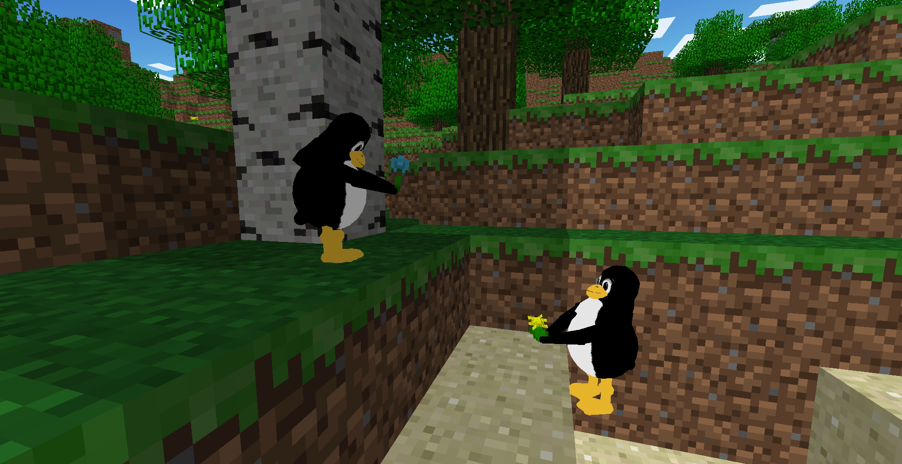
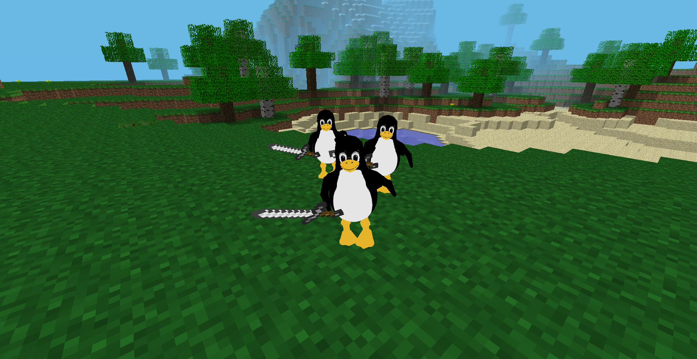
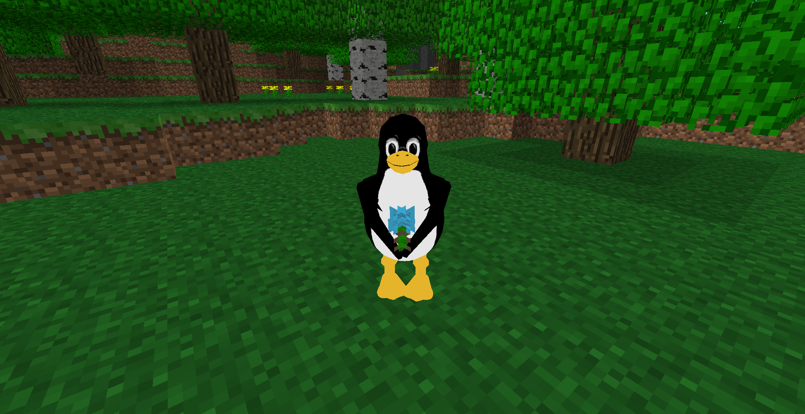
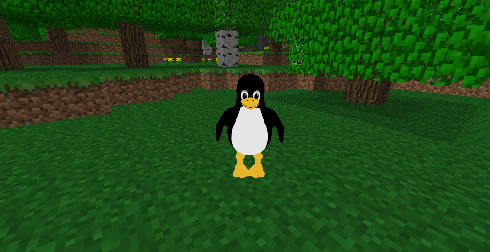

# TuxCraft

Fork of https://github.com/mschiller890/mcpe64 that adds Tux to the game.

## Screenshots

<table>
  <tr>
    <td align="center">
      
    </td>
    <td align="center">
      
    </td>
    <td align="center">
      
    </td>
    <td align="center">
      
    </td>
  </tr>
</table>